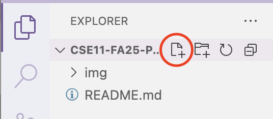
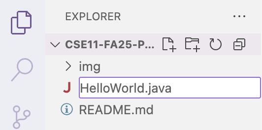
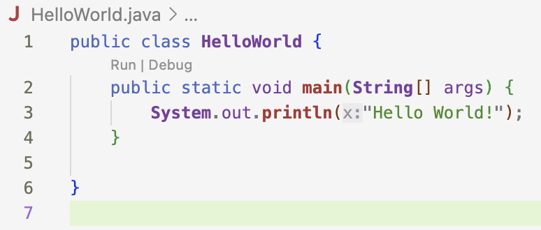
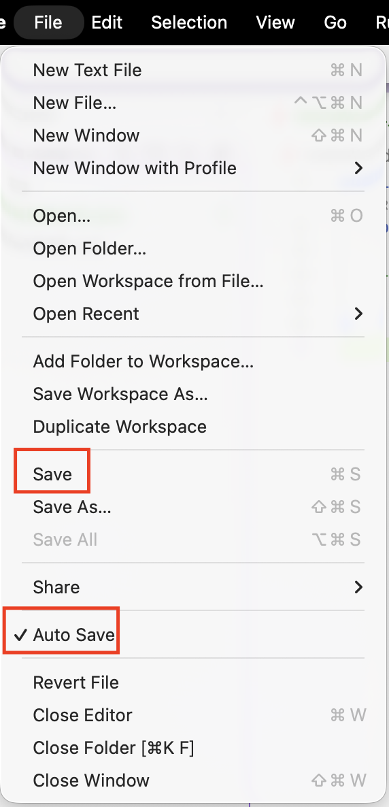
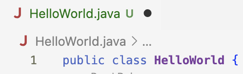
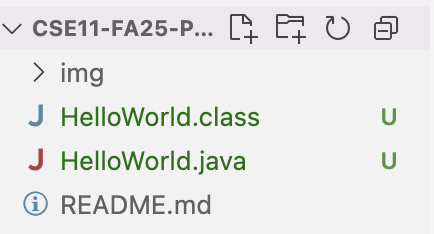

# CSE 11 Fall 2025 PA0 - Getting Started with CSE 11
**Due date: Thursday, October 2, 11:59 PM PDT**

## Learning Goals:

- Certify your commencement of academic activity in CSE 11
- Affirm your commitment to upholding academic integrity in CSE 11
- Install Java 11
- Install Visual Studio Code
- Write and compile a simple Java program
- Submit files to Gradescope

**NOTE: This programming assignment must be done individually.**

## Part 0: Prior Knowledge + Certification of Commencement of Academic Activity [0 points]

For every course at UC San Diego, per the US Department of Education, we
are **required** to certify whether students have commenced academic
activity for a class to count towards eligibility for Title IV federal
financial aid. This certification must be completed during the first two
weeks of instruction.

This requirement will be fulfilled via an **ungraded** "tell me about
yourself" quiz, which will assist the instructional team by providing
information about your background prior to the course. Complete this
quiz in [Canvas](https://canvas.ucsd.edu) by going to the
CSE 11 course and navigating to the Home tab. Under the Syllabus
drop-down tab, click \"First Day Survey: Prior Knowledge
#FinAid\" and complete the quiz.

## Part 1: Academic Integrity [0 points]

The CSE department supports the fundamental values of academic
integrity: honesty, respect, responsibility, fairness, trustworthiness,
and courage. Unlike courses from most other departments, you are
required to submit code, and there are specific programming
qualifications you need to know before you write any code. Most of the
time, students violate academic integrity just because they don't know
it is a violation. The below tutorial is your one-stop shop of academic
integrity to avoid such situations.

- Carefully read the academic integrity policy for this course, which is found in the syllabus tab on Canvas under "Academic Integrity".

- Please complete this [CSE Integrity of Scholarship Agreement](https://forms.gle/oYjguzUFaziCBGjR9).
By signing this, you acknowledge that you have completed and understood the tutorial as well as the agreement. **Although this part of the assignment is worth 0 points, if you do not complete the CSE Integrity of Scholarship Agreement, then you will receive an F in the course.**

## Part 2: Compile and Run Some Code [10 points]

The last part of this assignment is for you to compile and run your
first piece of code in CSE 11. If you're using UCSD Linux Cloud or you
are developing on a machine in the CSE basement, then JDK 11 is already
installed and configured on your CSE 11 class account so you don't need
to worry about the installation. However, if you prefer to work on a
personal computer, you can find the installation steps below for Windows
and macOS.

### Install Java 11

1. Navigate to the following link: [https://www.oracle.com/java/technologies/downloads/#java11](https://www.oracle.com/java/technologies/downloads/#java11)

2. Depending on your OS, select one of the following:

    

3. Installation steps for **Windows**:

    a. Choose the **x64 Installer**

    

    b. It will prompt you to create an Oracle account. Create one, login, and download the executable.

    c. If you receive a password validation error even though your passwords match, try creating the account in an Incognito/Private/InPrivate window.

    

    d. Run the executable that you just downloaded and follow through the setup wizard

    

    e. Install it in the default directory

    f. You should now have this. You can click close:

    

4. Installation steps for **MacOS**

    a. If you have a Mac with Apple Silicon, choose the **Arm DMG Installer**

    

    b. If you have a Mac with an Intel chip, choose **x64 Installer**
    

    c. It will prompt you to create an Oracle account. Create one, login, and download the executable.

    d. If you receive a password validation error even though your passwords match, try creating the account in an Incognito/Private/InPrivate window.
    

    e. Open the pkg installer and follow through the installation instructions

    

    f. Click "Continue" and you should see this:

    

    g. Provide your login credentials and click "Install". After installation, you should see the following:

    

    h. Click "close" and you're done!

Note: it's perfectly fine to see version "11.0.xx" (where xx is higher
than 18) in the above screenshots.

### Toggling Between Installed Java Versions

If you are on Mac and have more than one version of Java installed, the
following steps will show you how to set the default version of Java to
Java 11.x.

*If you are on Windows, ask on Piazza or come to office hours. We will
provide information on this if there's demand.*

1. Run the following command:

    ```bash
    $ /usr/libexec/java_home -V
    ```

    You should see something that looks like this:

    ```
    Matching Java Virtual Machines (3):

    12.0.2, x86_64: "Java SE 12.0.2"
    /Library/Java/JavaVirtualMachines/jdk-12.0.2.jdk/Contents/Home

    11.0.2, x86_64: "Java SE 11.0.2"
    /Library/Java/JavaVirtualMachines/jdk-11.0.2.jdk/Contents/Home

    1.8.0_131, x86_64: "Java SE 8"
    /Library/Java/JavaVirtualMachines/jdk1.8.0_131.jdk/Contents/Home

    /Library/Java/JavaVirtualMachines/jdk-12.0.2.jdk/Contents/Home
    ```

    Please ensure that you have a Java 11 installation.

2. Pick the Java 11 version and set it to default by running the following command:

    ```bash
    $ export JAVA_HOME=`/usr/libexec/java_home -v 11`
    ```

    You can also copy the exact version like this:

    ```bash
    $ export JAVA_HOME=`/usr/libexec/java_home -v 11.0.2`
    ```

### Verify Java Installation

Now you should have the right version of Java (i.e., Java 11) configured, but how can you verify this?

Open your terminal and go to the cse directory (do you remember where you created it?)

Then, run the following command:

**Linux and macOS:**
```bash
$ java -version
```

**Windows:**
```cmd
> java -version
```

You should see the Java version now. 

**Note:** If you run into issues or observe a different version number
when running these commands after you've installed JDK 11, you may
either need to:

1. Restart your terminal and run the commands again

2. Make changes to your system Path variable (though this is typically not necessary): [https://www.java.com/en/download/help/path.html](https://www.java.com/en/download/help/path.html)

Now that we have Java 11 installed, let's try to compile and run a piece
of code from the command line.

### Visual Studio Code

You can use any text editor (e.g., Vim, Notepad (Windows), TextEdit
(macOS)) you want to edit the files in your programming assignments. You
also have cloud-based options like **GitHub Codespaces**, which provides a
complete development environment in your browser without requiring local
installation. Do not use an Integrated Development Environment (IDE) that
automatically generates source code, as 1) you need to learn how to write
all source code yourself and 2) the resulting source code often will fail
to compile and/or run in Gradescope, resulting in a score of 0! Here, we
will be installing Visual Studio Code (VS Code), a lightweight, great
text editor. You can install VS Code by following the link below.

1. Navigate to this link: [https://code.visualstudio.com/download](https://code.visualstudio.com/download)

2. Download the respective executable:

    a. For Windows:

    

    b. For macOS:

    

3. Follow the installation instructions depending on your OS.

### Your First Java Program

You will create a new Java file named Assignment1.java in Visual Studio
Code.

1. Open up Visual Studio Code.

    a. If you are using a personal computer, you can open 'Visual Studio Code' like you would with a normal application.

    b. Alternatively, if you are on the **cmd, CLI, console, or terminal,** you can type in 'code' and it should open up Visual Studio Code as well (pretty neat right?).

2. You should be prompted with a page that looks similar to the one below:

    

3. Let's navigate to our **cse** directory we created before!

    Click on the Explorer tab and select "Open Folder" in VS Code to locate your directory.

    

4. We should be able to see our file explorer on the left-hand side.

    

5. Next, on the VS Code toolbar at the top, select Terminal → New Terminal.

    

6. Look familiar? You just opened up CLI in VS Code!

    

7. Now let's create a Java file called **Assignment1.java**. You can do this either from the CLI we just opened or by simply using VS Code.

    a. **CLI**
    
    Create the **Assignment1.java** file using 'touch' or 'type' or '$null >'
    

    b. **VS Code**

    Use the 'add file' icon.

    

    Name the file.

    

8. Type the contents of the screenshot below into your newly created Java file

    

9. Then, you need to write two lines of code below `// Put your code below`

    a. **My name is \<your name\>** starting from a new line. You'll need to use the System.out.println method to accomplish this. Refer to the source code line that prints out "Hello World!" but replace the text between the double quotation marks with My name is \<your name\>

    b. Then on another new line, tell the class what your favorite hobby is: **My favorite hobby is \<what your favorite hobby is\>**

10. Save this file to your cse directory by navigating to the top left-hand corner again or by pressing <**CTRL**> and **S** (Windows) or <**CMD**> and **S** (Mac) at the same time.

    

    You will know if your new code is saved when the white dot next to the filename at the top of the tab disappears. In the below screenshot, recent changes to Assignment1.java are unsaved.

    

11. After that, go back to the terminal and make sure you are within the cse directory. Before you run every Java code, you need to compile it first using the javac command.

    **Important Note:** If you make changes to a Java file, you will need to compile your code again before you can run the file with the updated changes.

    **Linux and macOS:**
    ```bash
    $ javac Assignment1.java
    ```

    **Windows:**
    ```cmd
    > javac Assignment1.java
    ```

    Notice that a brand new .class file appeared in the cse directory after compiling!

    

    Then you can run the program using the java command.

    **Linux and macOS:**
    ```bash
    $ java Assignment1
    ```

    **Windows:**
    ```cmd
    > java Assignment1
    ```

    You should see three lines of output in the terminal.

    ```
    Hello World!

    My name is Sumu

    My favorite hobby is acting
    ```

## Submission Instructions

**VERY IMPORTANT: Please follow the instructions below carefully and
make the exact submission format.**

1. Go to Gradescope and click on Assignment 1.

2. Click the DRAG & DROP section and directly select the required file **`Assignment1.java`**. Drag & drop is fine. *Please make sure you don't submit a zip.* Just this single file solely. *Make sure the name of the file is correct!*

3. **You can resubmit unlimited times before the due date.** Your score will depend on your final submission, even if your former submissions have a higher score.

4. The autograder is for grading your uploaded files automatically. For this first assignment, the autograder (grading script) will display to you the result/score of your submission immediately.

5. Your submission should look like the below screenshot. If you have any questions, feel free to post them on Piazza!


